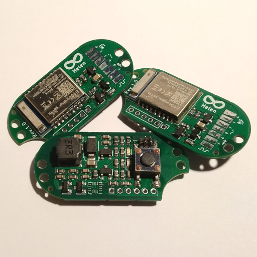
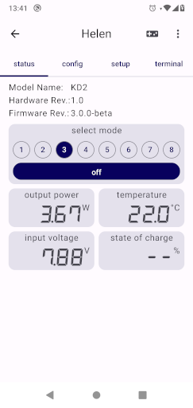

# Helen

 

Helen is an alternative circuit board for the Yinding or KD2 headlight cycling lamps

## Main Features

- Step-Down current converter with up to 3A.
- Linear power reduction at low battery and high temperature.
- Standby current less than 100µA.
- Supports 1 (one LED), 2 (one or two LEDs) or 3 (up to three LEDs in series) cell Li-Ion battery.
- optionally: An integrated motion sensor to control the output current to reduce glare when looking down.
- optionally: A 3A PWM source.
- optionally: A multi-functional com pin, can be used for wired communication, an external button or a low power PWM source
- support for the Helena Base Driver to add two additional 3A current sources.
