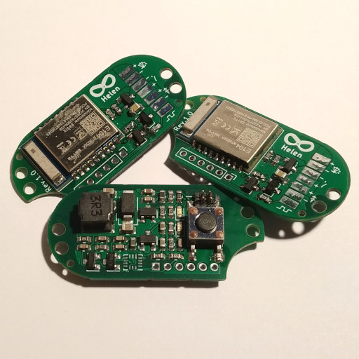

# Helena

 

Helen is an alternative driver for the Yinding or KD2 Headlight Cycling Lamp.

## Main Features

- Step-Down current converter with up to 3A
- bluetooth connectivity for remote control, configuration and lamp-to-lamp connection
- optionally an integrated motion sensor to control the output current to reduce glare when looking down

## License

This project is licensed under the BSD-2-clause License - see the [license.txt](license.txt) file for details
