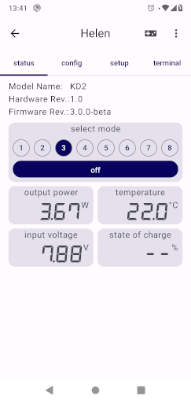

# Helen

 

Helen is an alternative driver for the Yinding or KD2 Headlight Cycling Lamp.

## Main Features

- Step-Down current converter with up to 3A
- bluetooth connectivity for remote control, configuration and lamp-to-lamp connection
- linear power reduction at low battery and high temperature
- standby current less than 100µA
- supports 1 (one LED), 2 (one or two LEDs) or 3 (up to three LEDs in series) cell Li-Ion battery
- optionally an integrated motion sensor to control the output current to reduce glare when looking down

## License

This project is licensed under the BSD-2-clause License - see the [license.txt](license.txt) file for details
